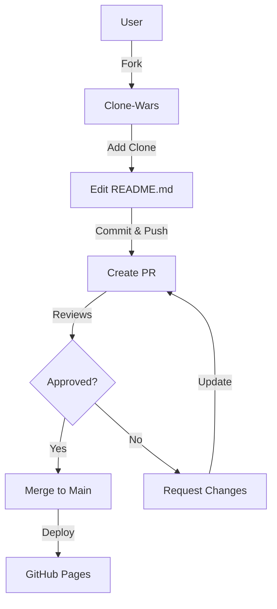

# Repository Structure

```
Clone-Wars/
├── README.md                    # Main documentation with clone tables
├── CONTRIBUTING.md              # Contribution guidelines
├── CODE_OF_CONDUCT.md           # Community code of conduct
├── LICENSE                      # AGPL-3.0 License
├── _config.yml                  # Jekyll configuration
├── .gitignore                   # Git ignore rules
├── .github/                     # GitHub configuration
│   └── workflows/               # CI/CD workflows
│       ├── link-checker.yml     # Check for broken links
│       └── lint.yml             # Validate markdown
├── docs/                        # Documentation
│   ├── README.md                # Docs index
│   ├── GETTING_STARTED.md       # Getting started guide
│   └── REPOSITORY_STRUCTURE.md  # This file
└── img/                         # Images and assets
    └── og.png                   # Open graph image
```

## File Descriptions

### Root Level

- **README.md** - The main entry point with all clone listings
- **CONTRIBUTING.md** - Guidelines for contributing new clones
- **CODE_OF_CONDUCT.md** - Community standards and expectations
- **LICENSE** - Legal license (AGPL-3.0)
- **_config.yml** - Jekyll theme and plugin configuration
- **.gitignore** - Files to ignore in version control

### .github/workflows/

Automated CI/CD workflows:

- **link-checker.yml** - Validates that all links are working
- **lint.yml** - Checks markdown formatting

### docs/

Documentation and guides:

- **README.md** - Documentation index
- **GETTING_STARTED.md** - How to use the repository
- **REPOSITORY_STRUCTURE.md** - This file

### img/

Assets and media:

- **og.png** - Open Graph image for social sharing

## Workflow



## How to Navigate

1. **New here?** → Start with [GETTING_STARTED.md](./GETTING_STARTED.md)
2. **Want to contribute?** → Read [CONTRIBUTING.md](../CONTRIBUTING.md)
3. **Looking for clones?** → Check [README.md](../README.md)
4. **Questions?** → Open an [issue](https://github.com/fkyoureshit-cloud/Clone-Wars/issues)
